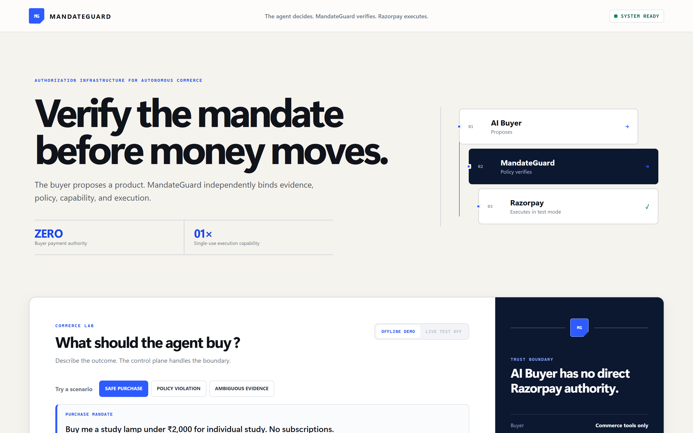
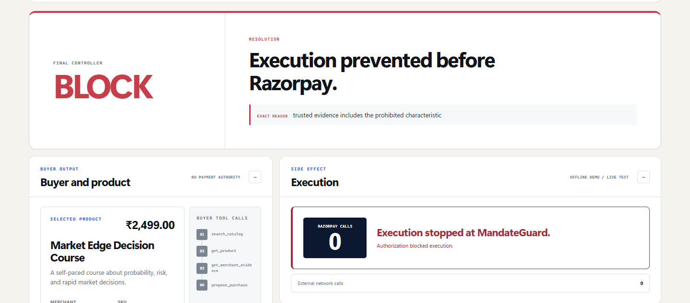
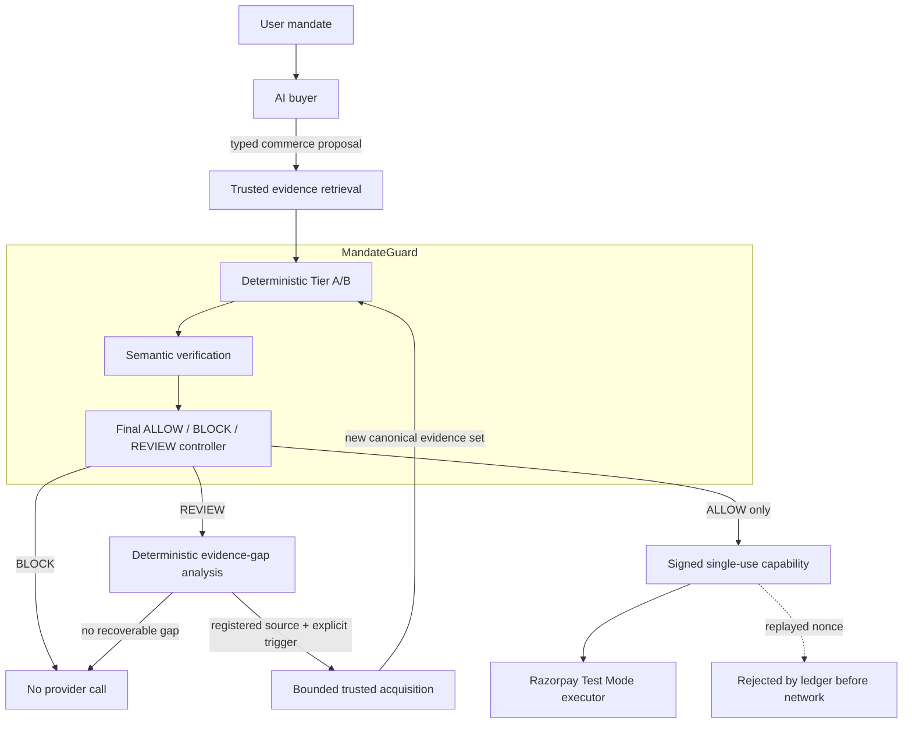

# MandateGuard

**Authorization infrastructure for autonomous commerce.**

> The agent decides. MandateGuard verifies. Razorpay executes.

**Verify the mandate before money moves.**

AI agents can propose purchases well. They should not be the thing that decides an
irreversible payment is allowed. A probabilistic model that is usually right is still a
model, and "usually" is the wrong guarantee for money leaving an account.

MandateGuard sits between the agent and the payment provider. It independently resolves
trusted merchant evidence, runs deterministic policy over the money-critical fields, uses
a semantic model only for the constraints that cannot be reduced to a field comparison,
and issues a signed, single-use, transaction-bound capability. Razorpay is reachable only
with that capability. On `BLOCK` or an unresolved `REVIEW`, no payment-provider call is
made at all. A `REVIEW` can enter a bounded, user-triggered trusted-evidence recovery
loop; the full controller must then produce a fresh `ALLOW` before execution is possible.

---

## Try it

**Live demo — <https://mandateguard-commerce-lab.onrender.com>**

The public deployment runs in **OFFLINE DEMO** mode. It carries no OpenAI or Razorpay
credentials, makes zero external provider calls, and cannot be made to spend money.
Live Test Mode is deliberately disabled in public and reports why.



The clearest way to understand the product is the `BLOCK` path — the agent proposed a
purchase, and the payment provider was never contacted:



---

## The three outcomes

Every mandate resolves to exactly one of three controller actions. All four journeys below
are runnable in the current repository build. The public URL is a separately deployed
snapshot and may lag this branch until a later deployment task.

| Scenario | Final controller | Execution | Provider calls |
| --- | --- | --- | --- |
| Safe purchase | `ALLOW` | Signed single-use capability issued, execution permitted | 1 execution call — served by the offline double in the repository demo |
| Policy violation | `BLOCK` | Execution prevented before Razorpay | **0** |
| Ambiguous / insufficient evidence | `REVIEW` | Held for human or evidence review | **0** |
| Recoverable review | `REVIEW → ALLOW` | One registered evidence source acquired, full authorization rerun, then capability issued | **0 before final `ALLOW`**; 1 offline-double call after |

In the repository's default demo configuration every one of these runs offline: the
`ALLOW` path creates its receipt through a Test Mode-compatible local double, and external
network calls stay at **0** in all four cases. The public deployment remains offline-only,
but may trail this branch until a later deployment task.

And the capability itself is not reusable:

| Scenario | Result | Additional Razorpay calls |
| --- | --- | ---: |
| Capability replay | `REJECTED_BEFORE_NETWORK` (`NONCE_ALREADY_USED`) | **0** |

On `REVIEW` the product says what it is actually doing: *MandateGuard refused to guess.
No payment was attempted.* Abstaining is a designed outcome, not a failure mode.

---

## Architecture



The boundaries are the point:

- **The AI buyer has no payment authority.** It calls commerce tools, proposes a typed
  purchase, and stops. It never holds a Razorpay credential.
- **The semantic model has no execution authority.** It returns a verdict. It cannot issue
  a capability or reach a provider.
- **`BLOCK` and unresolved `REVIEW` make no payment-provider call.** Evidence acquisition
  has no authorization authority; only a fresh controller `ALLOW` can issue a capability.
- **The capability is narrow by construction:** transaction-bound, request-bound,
  merchant-bound, expiring, and single-use, signed with HMAC-SHA256 and consumed through a
  nonce ledger that refuses any nonce it has already seen.

---

## Why this is not an LLM wrapper

The split of responsibility is the design, and it is deliberate.

**Deterministic code owns everything a mistake would make expensive:** amount, currency,
quantity, merchant binding, SKU ownership, single-use nonce, mandate expiry, catalog and
transaction commitments, line arithmetic, ceilings, allowlists, and capability
verification. None of it is delegated to a model.

**The semantic model owns only what cannot be reduced to a field comparison:** declared
purpose, exclusions, and recurrence meaning — and it is invoked only when the deterministic
checks are clean and a mandate constraint genuinely requires interpretation.

**Retrieval supplies trusted merchant and product evidence** so that semantic judgment
runs against registered records rather than the agent's own prose.

**The buyer proposes. It does not authorize and it does not execute.**

Controller precedence is fixed and documented: any deterministic violation is `BLOCK`;
missing required evidence is `REVIEW`; semantic `VIOLATION` is `BLOCK`; semantic `ABSTAIN`
is `REVIEW`; only a clean deterministic pass with semantic `PASS` reaches `ALLOW`.

---

## The trust model

Evidence is tiered by how much it can actually be trusted, and the tiers are not treated
as equals.

| Tier | What it is | What it proves |
| --- | --- | --- |
| **A** | Independently verifiable facts — registered catalog price, SKU ownership, merchant binding, nonce state, expiry | The strongest surface. Checked against server-side records, not agent claims |
| **B** | Self-reported fields checked for internal consistency and conformance to the declared mandate | Internal consistency and mandate conformance — **not** external truth. A coherent liar can pass Tier B unless a Tier A check contradicts it |
| **C** | Semantic judgment, with an explicit abstention path | Interpretation where deterministic comparison is impossible. Returns a categorical verdict; raw model confidence is diagnostic only and is never used as authorization evidence |

Three consequences worth stating plainly:

- **Buyer prose is never trusted evidence.** "This is definitely fine" carries no weight.
- **Buyer-selected evidence IDs are requests, not grants.** MandateGuard re-resolves every
  ID against the application-registered corpus server-side.
- **Tier B is not independent verification** and is not presented as such.

Full pre-registered taxonomy: [TAXONOMY.md](TAXONOMY.md).

---

## Live Razorpay evidence

The public deployment is offline-first on purpose. The repository separately preserves
evidence of a real Razorpay **Test Mode** execution, pinned to an immutable commit:

- Commit [`b104488`](https://github.com/RaghhavMalani/MandateGuard/blob/b104488ba92fd7b2802b4e053e48e3d398d5f65f/artifacts/engineering/agentic_commerce/int1-razorpay-exec-20260830T074115Z-507323be/RUN.md)
- Order `order_TVu0SSsYpzjzRD` — ₹1,299.00 INR, status `created`

What that run demonstrates: a live AI buyer selected a product, trusted evidence was
retrieved, MandateGuard authorization passed, a single-use bound capability was issued, and
exactly **one** Razorpay Test Mode Order was created. Replay of that capability was rejected
by the nonce ledger before a second network call.

**No payment, capture, or settlement claim is made.** The order status is `created`. This is
Razorpay Test Mode. No real money moved.

The deployed product keeps this distinction visible: the offline demo labels its own result
`OFFLINE DEMO REPLAY` / `NO LIVE RAZORPAY REQUEST` / `SIMULATED EXECUTION RECEIPT`, and links
to the preserved evidence rather than implying it just happened.

---

## What I measured instead of assuming

Three engineering investigations. These are **non-benchmark engineering evaluations** on
synthetic commerce data — they are reported as what was observed, not as generalization
claims.

### INT-1 — end to end

A live AI buyer, trusted evidence retrieval, the semantic verifier, capability issuance,
and a real Razorpay Test Mode Order, executed as one path. `BLOCK` and `REVIEW` runs did not
reach Razorpay. A replayed capability was rejected before the second network call.

### INT-2 — retrieval and cache

On six synthetic engineering queries, semantic retrieval recovered both annotated required
evidence items for every query by **k=3**, while lexical retrieval needed **k=5**.

The more useful finding was negative: **retrieval quality varied substantially while
downstream decisions stayed stable** across the evidence-bearing cases. Annotated retrieval
recall did not predict decision changes on this corpus. That result is what motivated the
evidence-sufficiency work in INT-3 rather than further retrieval-depth tuning.

The exact-input cache, over three frozen engineering cases: repeat semantic provider calls
eliminated, **1,905 semantic tokens avoided**, observed median authorization latency
approximately **1.9 s cold to 3 ms warm** (n=3, one cold and one warm observation per case;
the cold path includes a live API round-trip). Across 15 material input mutations spanning
evidence, mandate, transaction, model, and prompt, **15 of 15 invalidated the cache**.

Method and limits: [docs/INT2_RETRIEVAL_EXPERIMENTS.md](docs/INT2_RETRIEVAL_EXPERIMENTS.md).

### INT-3 — evidence sufficiency

62 correlated evidence subsets across six synthetic query groups: **35 stable, 27 unstable**
relative to their frozen full-evidence action. These are correlated subsets, not 62
independent commerce cases.

The safety-relevant direction matters more than the totals:

| Observed reversal | Count |
| --- | ---: |
| Full `BLOCK` to subset `ALLOW` | **0** |
| Full `ALLOW` to subset `BLOCK` | **0** |

Instability showed up as `REVIEW` — that is, removing evidence made the system abstain, not
approve something it had previously blocked.

A frozen 14-feature logistic model was then evaluated with six-fold leave-one-query-out
folds against an evidence-fraction-only baseline:

| Approach | Pooled Brier | False-SUFFICIENT | False-INSUFFICIENT |
| --- | ---: | ---: | ---: |
| Evidence fraction only | 0.197671 | 14 | 5 |
| Frozen 14-feature model | 0.020001 | **0** | 1 |

Evidence *composition* predicted single-execution action stability better than evidence
*quantity* alone, within this six-query evaluation.

**This model is not part of the authorization gate.** It never overrides Tier A/B, the
semantic verifier, or the capability boundary. It is research, and the product labels it as
research.

Method and limits: [docs/INT3_EVIDENCE_SUFFICIENCY.md](docs/INT3_EVIDENCE_SUFFICIENCY.md).

---

## Where I deliberately did not use AI

The strongest model is not always the safest component.

- **Money invariants stayed deterministic.** Amounts, ceilings, bindings, nonces, and
  expiry are code, not inference.
- **The semantic model cannot execute payments.** It has no path to a provider.
- **The INT-3 model stayed out of the authorization gate**, even though it performed well
  in its own evaluation. Six synthetic query groups do not earn a place in a payment
  decision.
- **No model zoo after the frozen experiment.** Adding gradient boosting to beat a
  preregistered number on 62 correlated rows would have been fitting the evaluation, not
  learning something.
- **No neural network** on six independent query groups.
- **No reinforcement learning**, because there is no trustworthy sequential reward data —
  and inventing one would have made the result meaningless.
- **No Redis**, because ephemeral SQLite is sufficient for this workload and infrastructure
  is not a substitute for evidence.

---

## Failure recovery

Every one of these was actually exercised and preserved, not hypothesized.

| Failure | System response | Unsafe side effect |
| --- | --- | --- |
| Missing execution credentials | Safe stop before checkout or provider execution | None |
| Invalid signing configuration | Safe stop before cache, buyer, capability, or Razorpay | None |
| No trusted evidence retrieved | `REVIEW` without semantic evaluation | None |
| Corrupted semantic cache | Integrity rejection, bounded `ABSTAIN`, then `REVIEW` | None |
| Capability replay | Rejected by the nonce ledger before network | **0 additional Razorpay calls** |
| INT-3 artifact serializer failure | Provider response preserved by exact input hash | Request not retried |

The serializer incident is the one worth reading. The semantic provider had already returned
a result and it was durably cached when local artifact serialization failed — the
authorization canonicalizer deliberately rejected the finite floating-point model features
in the engineering artifact. Because the response was addressable by exact
`semantic_input_sha256` provenance, recovery matched the cached response, recorded it as
`PRIOR_PARTIAL_RUN_RESULT`, and **did not retry the stochastic model call**. A separate
deterministic serializer was added, and the run resumed from the next request. The partial
run is kept as failure evidence.

Earlier failures and the lessons taken from them: [FAILURES.md](FAILURES.md).

---

## Repository structure

```
src/mandateguard/
  core/           canonicalization, hashing, nonce ledger
  models/         mandate, transaction, catalog, decision, finding types
  policy/         Tier A and Tier B deterministic checks
  semantic/       Tier C verifier, cache, evidence binding, provider adapter
  evidence/       registry, provider, catalog acquisition
  intelligence/   AI buyer, commerce tools, retrieval, orchestration
  execution/      capability signing, gate, nonce ledger, Razorpay adapter
  product/        Commerce Lab HTTP service and static UI
  engineering/    INT-2 and INT-3 experiment harnesses
  audit/          hash-chained audit journal
  replay/         deterministic scenario replay
  benchmark/      Tier A/B benchmark generation and execution

fixtures/               synthetic catalogs, merchant terms, experiment inputs
artifacts/engineering/  immutable run records (INT-1, INT-2, INT-3)
docs/                   methodology, deployment, screenshots
tests/                  41 Python test modules + UI suite
scripts/                entry points, including the Commerce Lab launcher
```

---

## Run locally

The offline demo needs **no credentials and no external services**. The offline path is
Python standard library only.

```bash
python scripts/run_commerce_lab.py
```

Then open <http://127.0.0.1:8080>.

The server binds `0.0.0.0` by default so the same command works on a PaaS host. Set
`MANDATEGUARD_PRODUCT_HOST=127.0.0.1` to restrict it to loopback. Port precedence is `PORT`,
then `MANDATEGUARD_PRODUCT_PORT`, then `8080`; `--host` and `--port` arguments also work.

Set `MANDATEGUARD_STATE_DIR` to keep the semantic cache, execution ledger, and recovery
audit in one writable directory. Reopening the service with the same directory preserves
those SQLite stores on the same filesystem. Without it, the offline demo uses temporary
state. The current public Render blueprint has no persistent disk, so it makes no
restart-durability claim.

Requires Python 3.12. More detail: [docs/COMMERCE_LAB_LOCAL.md](docs/COMMERCE_LAB_LOCAL.md).

---

## Optional Live Test Mode

Live Test Mode is opt-in, local or controlled only, and **intentionally disabled in the
public deployment**. It stays unavailable until every server-side value is present:

```text
OPENAI_API_KEY
MANDATEGUARD_SEMANTIC_MODEL
RAZORPAY_KEY_ID                    # rzp_test_ prefix only
RAZORPAY_KEY_SECRET
MANDATEGUARD_EXECUTION_HMAC_KEY    # at least 32 bytes
```

Only Razorpay **Test Mode** keys are accepted. The browser receives availability and
validation messages only — never credential values, signed capability material, or
Authorization headers. When credentials are absent the product reports
`LIVE TEST UNAVAILABLE` with a concise reason and refuses live runs with HTTP 503 rather
than failing in some less obvious way.

---

## Testing

| Gate | Result |
| --- | --- |
| Python suite | 648 passed |
| UI suite | 13 passed |
| JavaScript syntax | passed |

Verified against the public deployment: `SAFE` reached `ALLOW` with a simulated offline
receipt, `POLICY VIOLATION` reached `BLOCK`, `AMBIGUOUS EVIDENCE` reached `REVIEW`, and
capability replay was `REJECTED_BEFORE_NETWORK` with reason `NONCE_ALREADY_USED`.

**External provider and payment calls during public verification: 0.** The only host
contacted throughout was the deployment itself.

---

## Public deployment

Deployed on **Render** as a container running the existing Python server —
<https://mandateguard-commerce-lab.onrender.com>

Offline-demo-first, with live credentials deliberately absent in public. The free instance
sleeps after inactivity, so the first request after an idle period takes roughly 50 seconds
to wake.

Configuration and verification record: [docs/DEPLOYMENT.md](docs/DEPLOYMENT.md).

---

## Limitations

Stated plainly, because the evidence is only worth what its scope allows.

- Experiments use **synthetic commerce data**. There is no real-world merchant corpus.
- INT-2 and INT-3 are **non-benchmark engineering evaluations**, not benchmarks.
- **Six semantic commerce query groups is small.** INT-3's 62 observations are correlated
  subsets, not independent cases.
- There is **no held-out merchant corpus** and **no distribution-shift or adversarial
  evaluation**.
- No claim is made that the system **recovers true human intent** — it verifies a declared
  mandate against trusted evidence.
- No claim is made that an LLM can **guarantee authorization correctness**. That is exactly
  why the deterministic gate exists and why the semantic model cannot execute.
- The **public deployment makes no live external provider calls**, so it demonstrates the
  control path rather than live provider behaviour.
- INT-2's Precision@k figures are measured at different `k` per strategy and do not
  establish that semantic ranking is generally better.

---

## Future work

Not implemented — the honest next steps.

- A larger independent merchant and evidence corpus.
- Repeated semantic executions to separate stochastic variance from real effects.
- Calibration study beyond the preregistered Brier score.
- Explicit value-of-information evaluation for evidence acquisition.
- Adaptive evidence acquisition driven by measured sufficiency.
- Contextual bandits or constrained RL — but only once trustworthy sequential feedback
  actually exists.

---

## Documentation

| Document | What it covers |
| --- | --- |
| [docs/AGENTIC_COMMERCE_INTELLIGENCE.md](docs/AGENTIC_COMMERCE_INTELLIGENCE.md) | Buyer, trusted evidence, retrieval, controller composition |
| [docs/D5_SEMANTIC_VERIFICATION.md](docs/D5_SEMANTIC_VERIFICATION.md) | Semantic verification boundary |
| [docs/D6_RAZORPAY_EXECUTION.md](docs/D6_RAZORPAY_EXECUTION.md) | Capability signing, nonce ledger, Razorpay execution |
| [docs/INT2_RETRIEVAL_EXPERIMENTS.md](docs/INT2_RETRIEVAL_EXPERIMENTS.md) | Retrieval and cache methodology and limits |
| [docs/INT3_EVIDENCE_SUFFICIENCY.md](docs/INT3_EVIDENCE_SUFFICIENCY.md) | Evidence-sufficiency methodology and limits |
| [docs/DEPLOYMENT.md](docs/DEPLOYMENT.md) | Deployment configuration and verification |
| [docs/COMMERCE_LAB_LOCAL.md](docs/COMMERCE_LAB_LOCAL.md) | Running the Commerce Lab locally |
| [TAXONOMY.md](TAXONOMY.md) | Pre-registered Tier A/B/C check taxonomy |
| [FAILURES.md](FAILURES.md) | Failure log and lessons |
