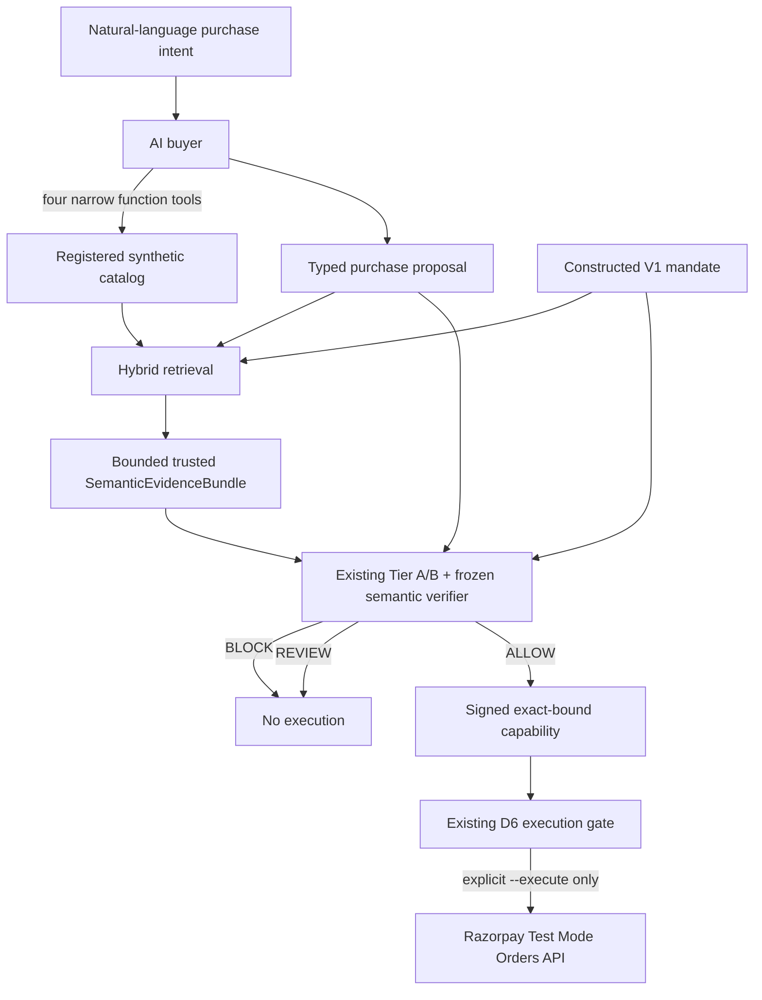

# Agentic Commerce Intelligence (INT-1)

> The agent decides. MandateGuard verifies. Razorpay executes.

INT-1 is a product/engineering vertical slice from natural-language purchase
intent to an optional Razorpay Test Mode Order. It does not give an AI model
payment authority. The buyer can discover registered products and return one
typed proposal. MandateGuard alone reduces the proposal and trusted evidence
to `ALLOW`, `REVIEW`, or `BLOCK`. The existing D6 executor alone can submit an
exact order after validating a short-lived signed `ALLOW` capability.



## Buyer authority boundary

The live buyer uses the OpenAI Responses API with strict custom function
tools. It receives only:

- `search_catalog(query, filters)`
- `get_product(merchant_id, sku)`
- `get_merchant_evidence(merchant_id, sku)`
- `propose_purchase(interpreted_intent, proposal)`

The buyer has no filesystem, shell, web search, arbitrary HTTP, capability
signing, MandateGuard bypass, Razorpay adapter, or executor tool. Its module has
no execution-package import. It can only terminate through a typed proposal
containing merchant, SKU, quantity, declared total, currency, a bounded reason,
and requested evidence IDs. No payment credential is part of that type.

The default offline buyer is deterministic and network-free. It exists for
tests and local demonstrations; it is not a claim of natural-language parsing
coverage.

## Trusted evidence and decision RAG

Buyer prose is never trusted evidence. A reason such as "this should be
allowed" remains trace-only buyer output. Buyer-selected evidence IDs are only
requests. MandateGuard resolves every ID against the application-registered
`TrustedCommerceStore`, rejects unknown or cross-product IDs, retrieves over
the registered text, and resolves the ranked IDs again when constructing the
`SemanticEvidenceBundle`.

The deterministic retrieval query commits four contexts:

1. raw user intent;
2. the constructed mandate and all hard/semantic constraints;
3. the proposed merchant, SKU, quantity, total, currency, and requested IDs;
4. the trusted product record.

Its SHA-256 hash is returned in the trace. The corpus contains mandate clauses
and registered merchant/product evidence. Prior-decision memory has a typed
source slot but is empty in INT-1.

This is decision RAG: retrieval chooses which trusted evidence reaches the
existing semantic authorization path. INT-1 does not introduce a second
semantic verifier.

## Hybrid retrieval

Lexical retrieval uses normalized TF-IDF token overlap. Semantic retrieval uses
cosine similarity over embeddings normalized to `[0, 1]`. The default live
embedding model is `text-embedding-3-small`; tests and default local demos use a
deterministic hashing backend and make no API call.

For every ranked item the trace records:

```text
document_id
source_type
lexical_score
semantic_score
hybrid_score
```

The transparent score is:

```text
hybrid_score = alpha * lexical_score + (1 - alpha) * semantic_score
```

`alpha` defaults to `0.4`; `top_k` defaults to `5`. There is no trained weight,
hidden reranker, or learned post-processing step. Equal scores use the stable
document ID as the final tie-break.

Retrieval depth affects semantic sensitivity because only retrieved trusted
merchant evidence enters authorization. If Tier A/B is otherwise clean and the
ranked window contains no such evidence, evidence sufficiency is `INSUFFICIENT`
and the product returns `REVIEW` without semantic evaluation or cache access;
it does not allow on missing evidence. This boundary does not establish that
recall is solved or that the default `top_k=5` is optimal.

The offline experiment harness exposes three variants—no retrieval, lexical
only, and hybrid—for later ablation work. It does not run an experiment or
claim that RAG improves quality.

## Content-addressed semantic cache

`SQLiteSemanticCache` implements the existing frozen `SemanticCache` protocol.
Its primary lookup key is `semantic_input_sha256`. The existing semantic
request hash already commits:

- detector, semantic prompt, and semantic model IDs;
- mandate payload hash and the exact semantic constraints;
- transaction body hash;
- catalog snapshot hash;
- trusted semantic evidence bundle hash; and
- the exact selected trusted evidence entries.

Therefore an evidence, mandate, transaction, model, or prompt change causes a
MISS. A SKU, user string, or verdict is never a cache key.

Each SQLite row stores only the normalized constraint results, semantic output
hash, model ID, prompt version, creation timestamp, and a row-integrity hash.
It stores no API key, provider secret, buyer prose, raw credentials, or hidden
chain-of-thought. `HIT`/`MISS` and a display-only cache-key prefix are visible in
the trace.

A malformed, mismatched, or unreadable row is never replayed. The orchestration
turns cache integrity or availability failure into a fresh bounded semantic
`ABSTAIN`, producing `REVIEW`. It never falls back to a cached `ALLOW`.

## Authorization and Razorpay gate

The product orchestration constructs the existing immutable `Mandate`,
`Transaction`, catalog snapshot, commitments, and replay scenario. It calls the
existing Tier A/B gate and existing semantic verifier. Precedence remains:

- deterministic Tier A/B violation -> `BLOCK`;
- deterministic evidence unavailable -> `REVIEW`;
- Tier A/B clean and semantic `VIOLATION` -> `BLOCK`;
- Tier A/B clean and semantic `ABSTAIN` -> `REVIEW`;
- Tier A/B clean and semantic `PASS` -> `ALLOW`.

`BLOCK` and `REVIEW` skip capability issuance and make exactly zero Razorpay
calls. Even after `ALLOW`, execution is not automatic. `--execute` must be
present, Test Mode credentials must be configured, the historical decision
must reproduce through semantic cache replay, and the existing D6 code must
issue and validate a signed capability binding the mandate, transaction,
authorization result, semantic input/output, merchant scope, environment,
audience, nonce, expiry, and exact Razorpay request hash.

The buyer never imports or references the D6 runtime. Execution orchestration
is downstream of MandateGuard.

## Observability and trace safety

The structured trace contains the intent, selected merchant/SKU and buyer
reason, deterministic retrieval query/hash and scores, Tier A statuses, Tier B
findings, semantic verdict/reasons, cache status/key prefix, final decision,
execution status, and these measurements:

- `buyer_latency_ms`
- `retrieval_latency_ms`
- `embedding_latency_ms`
- `semantic_latency_ms`
- `authorization_latency_ms`
- `total_latency_ms`

It records buyer, embedding, and semantic model IDs. Token counts are recorded
when the provider exposes them and remain null otherwise. Secrets, full signing
capabilities, signing material, Razorpay credentials, and authorization headers
are excluded.

## CLI

The default command is offline and stops after authorization:

```powershell
python scripts/run_agentic_checkout.py `
  --intent "Buy the StudyGlow Desk Lamp under INR 2000 for individual study; avoid subscriptions."
```

Available controls include `--live-ai`, `--execute`, `--catalog`, `--terms`,
`--top-k`, `--alpha`, `--trace-json`, and `--cache`.

Live AI requires `OPENAI_API_KEY` and `MANDATEGUARD_SEMANTIC_MODEL`.
`MANDATEGUARD_BUYER_MODEL` defaults to the semantic model when unset.
`MANDATEGUARD_EMBEDDING_MODEL` defaults to `text-embedding-3-small`.

`--execute` additionally requires:

- `RAZORPAY_KEY_ID` beginning with `rzp_test_`
- `RAZORPAY_KEY_SECRET`
- `MANDATEGUARD_EXECUTION_HMAC_KEY` with at least 32 bytes

The three default synthetic journeys are:

```text
StudyGlow Desk Lamp       -> semantic PASS      -> ALLOW
Market Edge Course        -> semantic VIOLATION -> BLOCK
Flexi Desk Companion      -> semantic ABSTAIN   -> REVIEW
```

Those actions are not fixture verdict fields. They emerge from the same buyer,
trusted evidence, retrieval, Tier A/B, and semantic controller flow. The
offline semantic component is explicitly a deterministic fake for product
demonstration and tests.

## Relationship to the frozen semantic MVP

INT-1 extends the frozen semantic MVP with buyer discovery, trusted evidence
retrieval, cache persistence/observability, product orchestration, and an
opt-in D6 composition root. It does not change the benchmark, taxonomy, 72
semantic engineering expectations, preserved diagnostic artifacts, semantic
reducer, or D6 enforcement boundary.

The preserved current diagnostic may be described only as:

> **NON-BENCHMARK ENGINEERING DIAGNOSTIC. NOT HELD-OUT GENERALIZATION
> EVIDENCE.** 68 / 72 semantic expectation matches; 72 / 72 controller
> invariant matches; 24 / 24 expected ABSTAIN matched ABSTAIN; 0 direct
> expected PASS <-> VIOLATION reversals.

This evidence is not a benchmark result, does not establish generalization,
and is not a claim that retrieval improves semantic quality.

## API references

- [OpenAI Responses API create reference](https://developers.openai.com/api/reference/resources/responses/methods/create)
- [OpenAI `text-embedding-3-small` model](https://developers.openai.com/api/docs/models/text-embedding-3-small)
